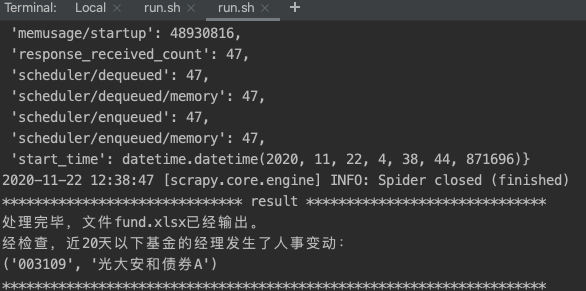

# fund-excess-returns-checker
检查：1）基金各个阶段的超额收益。2）基金经理是否变更

### USAGE STEP 1
##### funds.py文件下修改基金参数：

* compare_index是对比的指数基金或ETF代码

* fund是需要跟踪的基金(超额收益和经理人事变动)代码

* fund_extra是只需要跟踪基金经理是否变化的基金代码（适合债券和固收+）

### USAGE STEP 2
bash run.sh

### Outputs
会输出一个Excel文件 'fund.xlsx' 展示基金近期超额收益表现。

此外终端会提示经理人事变动情况，如下图所示：

### Requirements
scrapy~=1.6.0

lxml~=4.2.1

openpyxl~=2.5.3

### Update v1.1  2021.7
新增该基金的基金经理管理规模提示，小于100亿标红（表示管理规模小），大于400亿标绿（表示管理规模较大）。

### Acknowledgment
感谢天天基金网