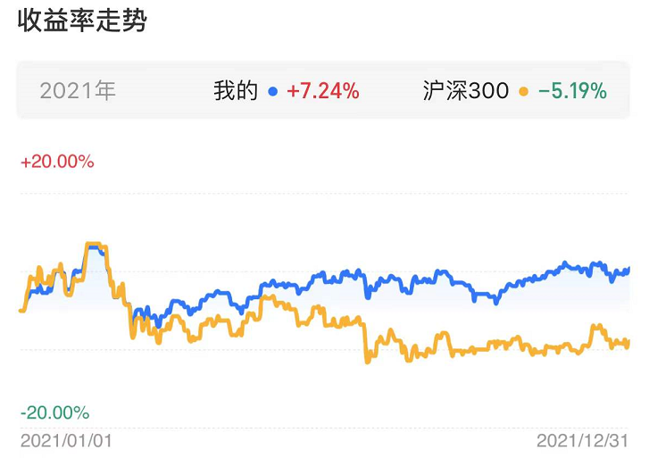

# fund-excess-returns-checker
检查：1）基金各个阶段的超额收益。2）基金经理是否变更

### USAGE STEP 1
##### funds.py文件下修改基金参数：

* compare_index是对比的股票基金或指数ETF代码

* compare_index_bond是对比的债券或固收+基金代码

* fund是需要跟踪的中高风险基金代码

* fund_bond是需要跟踪的中低风险基金代码

### USAGE STEP 2
bash run.sh

### Outputs
会输出一个Excel文件 'fund.xlsx' 展示基金近期超额收益表现。

此外终端会提示经理人事变动情况，如下图所示：

### Requirements
scrapy~=1.6.0

lxml~=4.2.1

openpyxl~=2.5.3

pandas

chinese_calendar

### Update v1.1  2021.7
新增该基金的基金经理管理规模提示，小于100亿标红（表示管理规模小），大于300亿标绿（表示管理规模较大）。

<!-- ### Update v1.2  2022.1
在fund.py文件中会更新我的持仓，希望市场能让我们写代码赚的辛苦钱持续稳健增值。我的持仓风格是多元化全球资产配置，股8债2，投资中国、美国、香港、日本市场。

附2021年收益图：
 -->

### Update v1.2  2022.5
增加了对中低风险基金的详细对比支持。

### Update v1.3  2022.11
增加了对中信股指期货持仓的统计。

### Update v1.4  2023.01
代码细节优化

### Update v1.4.1  2023.07.22
适配基金估值下线后的天天基金前端

### Acknowledgment
感谢天天基金网和新浪财经网